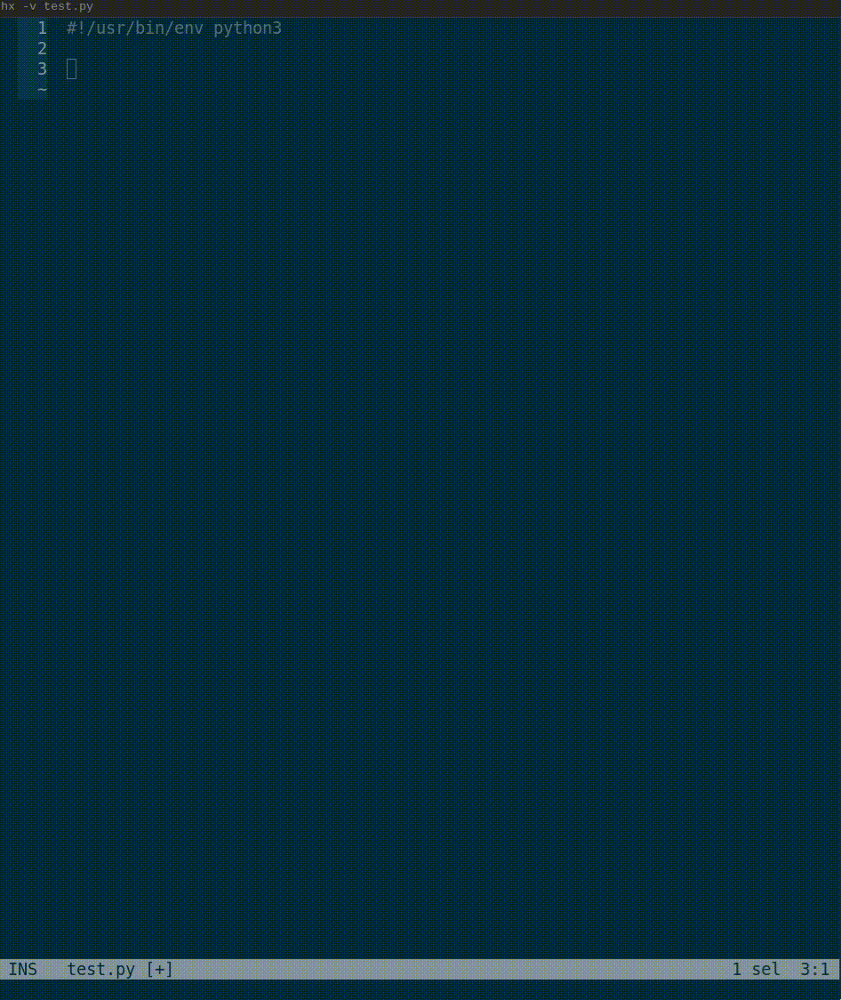

# pylsp-llmls

copilot-style LLM autocomplete as a python lsp plugin

Uses litellm under the hood, allowing users to plug in any LLM provider - using local ollama by default

This is a plugin for [Python LSP Server](https://github.com/python-lsp/python-lsp-server).

## Installation

To use this plugin, you need to install this plugin in the same virtualenv as python-lsp-server itself.

It's not available on pypi (yet?), so install from source:
``` bash
pip install git+https://github.com/mtbentley/pylsp-llmls.git#egg=pylsp-llmls
```

Then run `python-lsp-server` as usual, the plugin will be auto-discovered by
`python-lsp-server` if you've installed it to the right environment. Refer to
`python-lsp-server` and your IDE/text editor documentation on how to setup
`python-lsp-server`.

## Configuration

This plugin has two options:
- `pylsp.plugins.pylsp_llmls.model`: instructs the plugin what model to use with litellm. Defaults to `ollama/deepseek-coder-v2:16b`
- `pylsp.plugins.pylsp_llmls.options`: dictionary (str->str) of settings to pass as kwargs to litellm's completion. Defaults to `{"api_base": "http://localhost:11434"}`

To configure ollama in helix, add the following to your `languages.toml`:
```toml
[language-server.pylsp.config]
pylsp.plugins.pylsp_llmls.model = "ollama/deepseek-coder-v2:16b"
pylsp.plugins.pylsp_llmls.options = { "api_base" = "http://localhost:11434"}
```

To use with openai (eg, gpt-4o), add the following to your `languages.toml`:
```toml
[language-server.pylsp.config]
pylsp.plugins.pylsp_llmls.model = "gpt-4o"
pylsp.plugins.pylsp_llmls.options = { "api_key" = "$API_KEY"}
```

See [the litellm docs](https://docs.litellm.ai/docs/providers) for details on more providers

## Features

This plugin adds the following features to `pylsp`:
- `LLM Autocomplete` action: autocompletes the selected code
- `LLM Instruct` action: must start with at least one full-line comment then optional code - tells the LLM to follow the commented instructions, then replaces the selection with the result



## ToDo
A couple more things I want to do to make this better...
- [ ] add a "instruct and append" action - similar to the existing "instruct", except it takes an instruction, some context code, and then adds the result below
- [ ] fine tune a model?

## Developing

Install development dependencies with (you might want to create a virtualenv first):

``` bash
git clone  pylsp-llmls
cd pylsp-llmls
pip install -e '.[dev]'
```

### Enabling logging

To enable logging in pylsp:

    pylsp -v --log-file /tmp/pylsp.log

### Enabling tcp mode

Normally, editors communicate with language servers through standard
input/output. Optionally, you can run pylsp in tcp mode if you want to be able
to use the standard input/output, for example so you can use IPython or pudb,
using the --tcp flag:

    pylsp -v --log-file /tmp/pylsp.log --tcp --port 7090

Consult your lsp client documentation on how to connect to tcp-mode language
server, but if it doesn't support connecting to a language server via TCP, then
usually can configure `netcat`/`nc` to be your "language server" that will
proxy requests to a tcp-mode language server:

    nc localhost 7090

TODO: document how to connect to pylsp via pylsp from LSP clients.
### Testing 

Run `pytest` to run plugin tests.


## Credits

This package was created with
[Cookiecutter](https://github.com/audreyr/cookiecutter) from 
[python-lsp/cookiecutter-pylsp-plugin](https://github.com/python-lsp/cookiecutter-pylsp-plugin)
project template.
